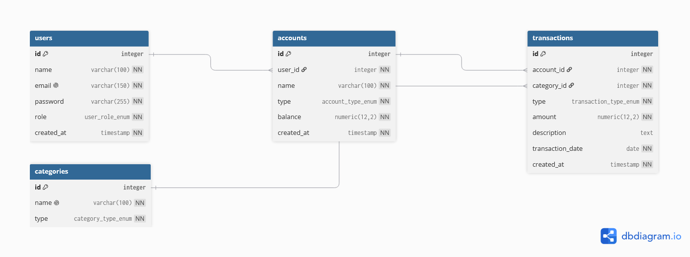

# FinTrack API 💸

A personal-finance tracker backend built with **NestJS**, **TypeScript**, **Prisma ORM**, and **PostgreSQL (Supabase)**. Users can manage accounts, categories, and transactions with automatic balance recalculation, secured by JWT authentication and role-based access control.

🔗 **Live URL (Railway):** `https://milestone-4-setiawanhennie-glitch-production.up.railway.app`

---

## 🛠 Tech Stack

| Layer      | Technology |
|------------|------------|
| Framework  | NestJS (TypeScript) |
| ORM        | Prisma |
| Database   | PostgreSQL (hosted on Supabase) |
| Auth       | JWT (`@nestjs/jwt`) + bcrypt password hashing |
| Security   | `helmet`, explicit CORS, `@nestjs/throttler` rate limiting |
| Validation | `class-validator` + global `ValidationPipe` |
| Hosting    | Railway |

---

## ✨ Features

- Full CRUD for **accounts**, **categories**, and **transactions**
- **Authentication**: `POST /auth/register` + `POST /auth/login` (bcrypt-hashed passwords, JWT issued on login)
- **Authorization**: `JwtAuthGuard` on all account/transaction routes + per-user **ownership enforcement**
- **RBAC**: `user | admin` roles with `RolesGuard` (admin-only actions: `GET /users`, category write operations)
- **Relational queries** via `?include=` (e.g. `/transactions?include=category`)
- **Balance business logic**: income adds, expense subtracts — recalculated on create/update/delete
- **Request-logging middleware** (method, path, status code, response time)
- **Rate limiting** on `POST /auth/login` (5 req/min)

---

## 🚀 Getting Started (Local)

**Prerequisites:** Node.js 18+, a PostgreSQL database (local or Supabase)

```bash
# 1. Clone & install
git clone https://github.com/Revou-FSSE-Feb26/milestone-4-setiawanhennie-glitch
cd milestone-4-setiawanhennie-glitch
npm install

# 2. Configure environment
cp .env.example .env

# 3. Create schema + seed data
npx prisma migrate dev
npx prisma db seed

# 4. Run
npm run start:dev      # API at http://localhost:3000
```

---

## 🔑 Environment Variables (`.env.example`)

```env
# Database (Supabase session-pooler connection string)
DATABASE_URL="postgresql://postgres.<ref>:<password>@aws-0-<region>.pooler.supabase.com:5432/postgres?sslmode=require"

# Server
PORT=3000

# Auth
JWT_SECRET=change-me-to-a-long-random-string
JWT_EXPIRES_IN=1h

# CORS — comma-separated allowed origins (explicit, no wildcard)
CORS_ORIGIN=http://localhost:3000
```

---

## 👤 Demo Accounts (seeded)

| Email             | Password      | Role  |
|-------------------|---------------|-------|
| alice@example.com | `password123` | user  |
| bob@example.com   | `password123` | user  |
| carol@example.com | `password123` | admin |

---

## 📡 API Reference

### Auth (public)
| Method | Endpoint         | Notes |
|--------|------------------|-------|
| POST   | `/auth/register` | Creates user, returns sanitized user (no password hash) |
| POST   | `/auth/login`    | Returns `{ access_token }` — **rate limited (5/min)** |

### Users (🔒 JWT)
| Method | Endpoint      | Notes |
|--------|---------------|-------|
| GET    | `/users`      | 🔐 **admin only** |
| GET    | `/users/:id`  | Self or admin |

### Accounts (🔒 JWT, ownership enforced)
| Method | Endpoint        | Notes |
|--------|-----------------|-------|
| GET    | `/accounts`     | Only your own accounts (admin: all) |
| GET    | `/accounts/:id` | 403 if not owner |
| POST   | `/accounts`     | Creates for yourself (admin may set `userId`) |
| PATCH  | `/accounts/:id` | Owner or admin |
| DELETE | `/accounts/:id` | Owner or admin |

### Categories (reads public, writes admin)
| Method | Endpoint          | Notes |
|--------|-------------------|-------|
| GET    | `/categories`     | Public, supports `?type=income\|expense` |
| GET    | `/categories/:id` | Public |
| POST   | `/categories`     | 🔐 admin only |
| PATCH  | `/categories/:id` | 🔐 admin only |
| DELETE | `/categories/:id` | 🔐 admin only |

### Transactions (🔒 JWT, ownership enforced via account)
| Method | Endpoint           | Notes |
|--------|--------------------|-------|
| GET    | `/transactions`    | Own only; supports `?type=`, `?account_id=`, `?include=category` |
| GET    | `/transactions/:id`| 403 if not owner; supports `?include=category` |
| POST   | `/transactions`    | Must own the account; updates account balance |
| PATCH  | `/transactions/:id`| Recalculates balance (reverses old, applies new) |
| DELETE | `/transactions/:id`| Reverses balance effect |

### Auth flow example

```bash
# 1. Login
curl -X POST https://milestone-4-setiawanhennie-glitch-production.up.railway.app/auth/login \
  -H "Content-Type: application/json" \
  -d '{"email":"alice@example.com","password":"password123"}'

# 2. Use the token
curl https://milestone-4-setiawanhennie-glitch-production.up.railway.app/accounts \
  -H "Authorization: Bearer eyJhbGciOi..."
```

---

## 🏗 Architecture & DI Summary

```
src/
├── auth/          # AuthModule (@Global): register/login, JWT issuing, guards & decorators
├── accounts/      # AccountsModule: CRUD + ownership checks + balance updates
├── categories/    # CategoriesModule: shared reference data (admin-managed)
├── transactions/  # TransactionsModule: CRUD + balance recalculation
├── users/         # UsersModule: profile reads (sanitized responses)
├── balance/       # BalanceCalculatorService (pure business logic)
├── middleware/    # LoggingMiddleware (registered globally via configure())
└── prisma/        # PrismaModule (@Global): shared PrismaService (DB access)
```

- **Layering:** Controllers handle HTTP only; Services hold business logic; PrismaService is the single DB gateway.
- **Global modules:** `PrismaModule` and `AuthModule` are `@Global()` so `PrismaService` and `JwtService` are injectable anywhere (guards included).
- **Guards:** `JwtAuthGuard` verifies the Bearer token and attaches the payload to the request; `RolesGuard` + `@Roles()` enforce RBAC.
- **Middleware:** `LoggingMiddleware` logs `method, path, status, response-time` for every request, registered globally in `AppModule.configure(consumer)`.

### DI note: `BalanceCalculatorService`
The balance rules (income adds, expense subtracts, transfer is neutral) were previously duplicated inside the transaction create/update/delete flows. They are now factored into a dedicated `BalanceCalculatorService` — a single, unit-testable source of truth. It is registered via a **`useFactory` custom provider** in `AccountsModule` to demonstrate DI beyond the default `@Injectable()` registration.

---

## 🗄 Entity-Relationship Diagram



- `users 1 ── ∞ accounts`
- `accounts 1 ── ∞ transactions`
- `categories 1 ── ∞ transactions`

---

## 🧪 Testing

- **Postman collection:** `docs/fintrack.postman_collection.json`
- **Postman environment:** `docs/fintrack.postman_environment.json` (defines `base_url` and `token` variables)
  - Import both files. Select "FinTrack Environment" in the top-right dropdown.
  - The collection sends `Authorization: Bearer {{token}}` automatically.
  - The **login** request's test script saves the token into the environment after login.
- **Smoke test examples** (request + response per endpoint, incl. blocked 401/403 cases): `docs/api-smoke-test.md`

---

## ☁️ Deployment (Railway)

- **Build:** automatic via Nixpacks on every `git push`
- **Start command:** `npm run start:prod`
- **Environment variables on Railway:** `DATABASE_URL`, `JWT_SECRET`, `JWT_EXPIRES_IN`, `PORT` (auto)
- The app also sets `helmet()` security headers and an explicit CORS allowlist (`CORS_ORIGIN`).

---

## ⚠️ Known Limitations

- Rate limiting is **per-instance in-memory** (not shared across multiple replicas).
- JWTs are stateless: no token revocation/blacklist before expiry.
- `transfer` transactions do not yet move money between two accounts.
- Hosted on Railway's free trial (30 days / $5 credit)